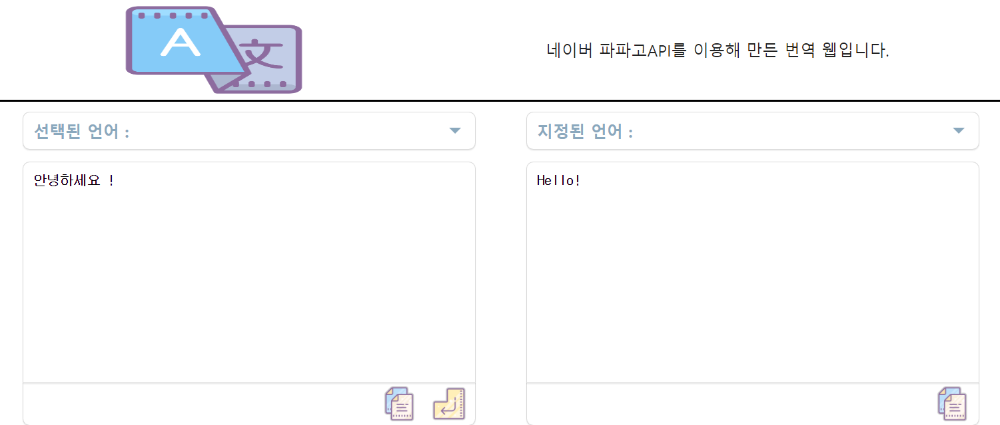

# Papago translate app

<a>https://hdw0903.github.io/papago/</a>

------

## Development

> npm start

------

## Description

* 기본적으로 언어 감지기능을 적용하여 한국어 입력시 영어로,
그외의 언어는 한국어로 변역되게 되어있습니다.
드롭다운 내에 언어를 선택한다면 원하는 언어끼리 번역도 가능합니다.

* Papago 오픈 API를 사용했으며 하루 10000쿼리량만 번역할 수 있습니다.

* react-toastify를 사용하여 오류,복사완료 안내 메세지를 토스트로 띄어봤습니다.

* 웹 호스팅은 Github 무료 호스팅 서비스인 gh-pages를 사용했습니다.

* API KEY 값들은 .env 로 gitignore 처리 후 git secrets에 따로 저장해 줬습니다.

-------

### 제작과정 및 에러사항

#### React

* 번역 page
    * 언어감지 기능과 번역기능을 제작과정 중 API호출과 타이핑된 텍스트를 setState로 담는 작업모두 비동기동작이므로 페이지렌더링이 재대로 되지않았습니다.
      * 타이핑시 마다 호출되는 언어감지기능에 Debounce를 적용하고 useEffect를 사용하여 언어감지API호출과 번역 API호출을 순차적으로 실행되게 만들었습니다.

    * AWS 서버 구축까지 완료후 API통신을 확인해보니 API호출시 개발자도구 Network창에 naver secret key가 노출되는 현상을 발견했습니다. 
      * key를 넘겨주는 방식을 html -> node server -> naver API 방식에서 node server -> naver API로 변경하여 key값을 server에서 관리하고 숨겨줄 수 있게 했습니다.

* Naver Papago API
    * local 서버로 Naver papago API 통신시에는 잘작동하였으나 Github Pages로 홈페이지를 만들고 API호출하니 cors 에러가 발생했습니다. 
      * 원인은 Naver paapgo API가 제 페이지같은 정적페이지호출을 지원하지 않고 오직 서버 호출만 지원하는 것이었습니다. 개인 서버가 필요해졌습니다..

#### Node server

* AWS로 서버를 구축하기로 결심했습니다.
    * 서버 환경구축을 위해 Docker를 사용했습니다.
    * git repo에 푸쉬시 자동배포가 되도록 git과 연동되는 travis를 이용했습니다.

* https - http 통신 문제
    * github pages로 제공되는 번역page는 https인 반면 AWS로 구축한 서버는 http 프로토콜을 가지고있었습니다. https에서 http로 통신하려하니 크로스도메인 이슈가 발생했습니다.
        * 무료 도메인을 구입했습니다.
        * 제 도메인을 AWS로 https 인증서 발급 후 AWS 서버와 도메인을 연결해줬습니다.
 
* corsOptions로 설정된 whiteList를 제외하고는 호출되지않게 했습니다.

------

### Skill

*  React { useState, useEffect, useMemo, useCallback }

*  Node.js { express, Axios nodemonm, cors, dotenv }
 
*  Postman

*  CustomHooks 
    * UseDebounce
    * UseToastify

*  CustomComponent
    * TextArea
    * ImgButton
    * DropdownSelectBox  

* Dynamic Dropdown

* Responsive Wep Design

------

### SupportLanguages

|     * 한국어(ko) ->     	|                      	|                      	|                      	|                      	|
|:-----------------------:	|:--------------------:	|:--------------------:	|:--------------------:	|:--------------------:	|
|                         	|      - 영어(en)      	| - 중국어 번체(zh-TW) 	|    - 러시아어(ru),   	|  - 인도네시아어(id)  	|
|                         	|     - 일본어(ja)     	|    - 스페인어(es),   	|    - 베트남어(vi),   	|     - 독일어(de)     	|
|                         	| - 중국어 간체(zh-CN) 	|    - 프랑스어(fr),   	|     - 태국어(th)     	|   - 이탈리아어(it)   	|
|      * 영어(en) ->      	|                      	|                      	|                      	|                      	|
|                         	|     - 한국어(ko)     	| - 중국어 간체(zh-CN) 	| - 중국어 번체(zh-TW) 	|    - 프랑스어(fr)    	|
|                         	|     - 일본어(ja)     	|    - 베트남어(vi)    	|     - 태국어(th)     	|                      	|
|     * 일본어(ja) ->     	|                      	|                      	|                      	|                      	|
|                         	|      - 한국(ko)      	|      - 영어(en)      	| - 중국어 간체(zh-CN) 	| - 중국어 번체(zh-TW) 	|
| * 중국어 간체(zh-CN) -> 	|                      	|                      	|                      	|                      	|
|                         	|     - 한국어(ko)     	|      - 영어(en)      	| - 중국어 번체(zh-TW) 	|     - 일본어(ja)     	|
| * 중국어 번체(zh-TW) -> 	|                      	|                      	|                      	|                      	|
|                         	|     - 한국어(ko)     	|      - 영어(en)      	| - 중국어 간체(zh-TW) 	|     - 일본어(ja)     	|
|    * 스페인어(es) ->    	|                      	|                      	|                      	|                      	|
|                         	|     - 한국어(ko)     	|      - 영어(en)      	|                      	|                      	|
|    * 프랑스어(fr) ->    	|                      	|                      	|                      	|                      	|
|                         	|     - 한국어(ko)     	|      - 영어(en)      	|                      	|                      	|
|    * 러시아어(ru) ->    	|                      	|                      	|                      	|                      	|
|                         	|     - 한국어(ko)     	|                      	|                      	|                      	|
|    * 베트남어(vi) ->    	|                      	|                      	|                      	|                      	|
|                         	|     - 한국어(ko)     	|      - 영어(en)      	|                      	|                      	|
|     * 태국어(th) ->     	|                      	|                      	|                      	|                      	|
|                         	|     - 한국어(ko)     	|      - 영어(en)      	|                      	|                      	|
|  * 인도네시아어(id) ->  	|                      	|                      	|                      	|                      	|
|                         	|     - 한국어(ko)     	|                      	|                      	|                      	|
|      * 독일(de) ->      	|                      	|                      	|                      	|                      	|
|                         	|     - 한국어(ko)     	|                      	|                      	|                      	|
|   * 이탈리아어(it) ->   	|                      	|                      	|                      	|                      	|
|                         	|     - 한국어(ko)     	|                      	|                      	|                      	|